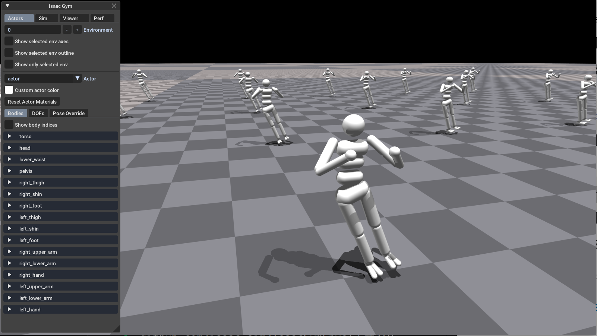

## 来自cdh的基于学习的运动控制
本仓库包含cdh的运动控制研究。
## 🔥 最新消息
- [2025年3月30日] cdh创建了本仓库。
## 📝 待办事项列表
- [x] 完成本仓库关于环境的搭建并给出搭建流程。
- [ ] 完成本仓库关于机器人模型的搭建并给出搭建流程。
- [ ] 完成本仓库关于策略的搭建并给出搭建流程。

## 📚 入门指南
### 安装

在以下环境中测试了代码：

- Ubuntu 20.04
- [NVIDIA驱动程序](https://www.cnblogs.com/nannandbk/p/18144618)：535.183.01
- [CUDA 12.0](https://blog.51cto.com/u_16213611/10480090)
- Python 3.8 
- [PyTorch 1.13.1+cu117](https://pytorch.org/get-started/previous-versions/)
- [Isaac Gym：preview4](https://developer.nvidia.com/isaac-gym/download)
- [rsl_rl](https://github.com/leggedrobotics/rsl_rl)
 
**1. 创建环境&安装pytorch**
-  创建python3.7环境：
    ```bash
    conda create -n cdh python=3.8 && conda activate cdh
    ```
-  安装PyTorch 1.13.1+cu117：
    ```bash
    pip install torch==1.13.1+cu117 torchvision==0.14.1+cu117 torchaudio==0.13.1 --extra-index-url https://download.pytorch.org/whl/cu117
    ```
 
**2. 安装Isaac Gym**

-  从 [Isaac Gym官网](https://developer.nvidia.com/isaac-gym) 下载 Isaac Gym preview4 。
-  解压至主目录：
    ```bash
    tar -xzvf IsaacGym_Preview_4_Package.tar.gz -C ~
    ```
-  开始安装环境：
    ```bash
    conda activate cdh && cd ~/isaacgym/python && pip install -e .
    ```
-  设置快速激活环境的别名，输入 `cdh` 即可激活虚拟环境：
    ```bash
    echo "alias cdh='conda activate cdh'" >> ~/.bashrc && source ~/.bashrc
    ```
-  测试安装：
    ```bash
    cdh && cd ~/isaacgym/python/examples && python joint_monkey.py
    ```
-  出现以下界面即安装成功：


**3. 安装rsl_rl库**

- 从 [rsl_rl github仓库](https://github.com/leggedrobotics/rsl_rl) 下载ZIP。
- 解压至主目录并更改文件夹名字：
```bash
unzip rsl_rl-main.zip -d ~ && mv ~/rsl_rl-main ~/rsl_rl
```
- 开始安装环境：
```bash
cdh && cd ~/rsl_rl && pip install -e .
```
- 出现success即安装成功。
 
 
**4. 克隆仓库**
-  克隆本仓库至主目录：
```bash
cd ~ && git clone https://github.com/cdh66666/cdh.git
```
<!-- **4. 安装cdh**
```bash
cdh && cd ~/cdh && pip install -e . ##待定
``` -->

**5. 测试示例**
- 运行以下代码，能出现仿真界面即安装成功：
```bash
cdh && cd ~/cdh/test && python test.py
```


### 教程
**📚官方文档**：解压安装包后，可以在`isaacgym/docs`目录下找到`index.html`文件，双击即可打开官方文档。

**📚cdh文档**：
1. 训练一个策略：
  - `cdh && cd ~/cdh/scripts && python train.py`
 

2. 运行并导出最新的策略：
  - `cdh && cd ~/cdh/scripts && python play.py`
 
 